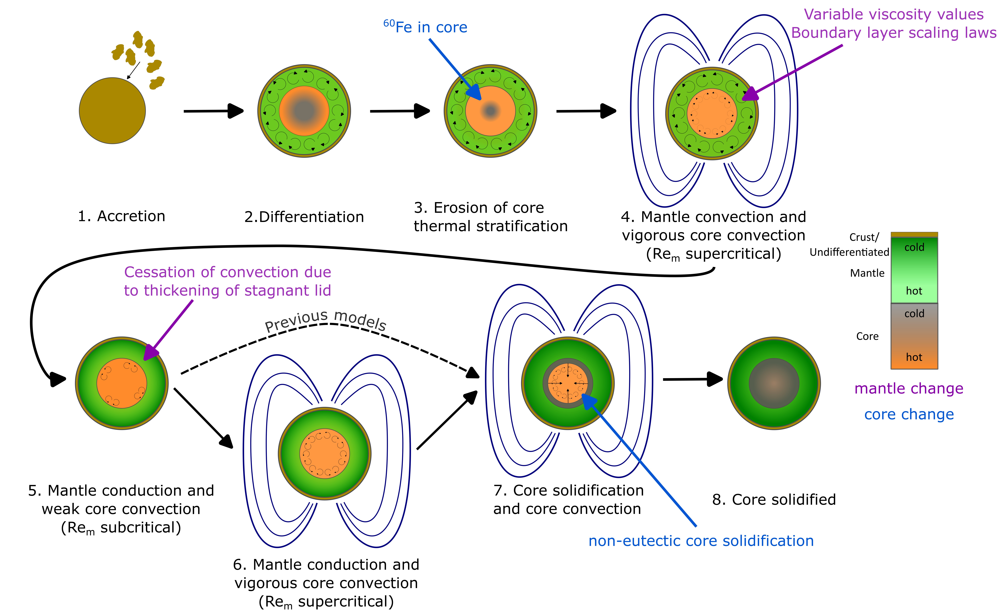
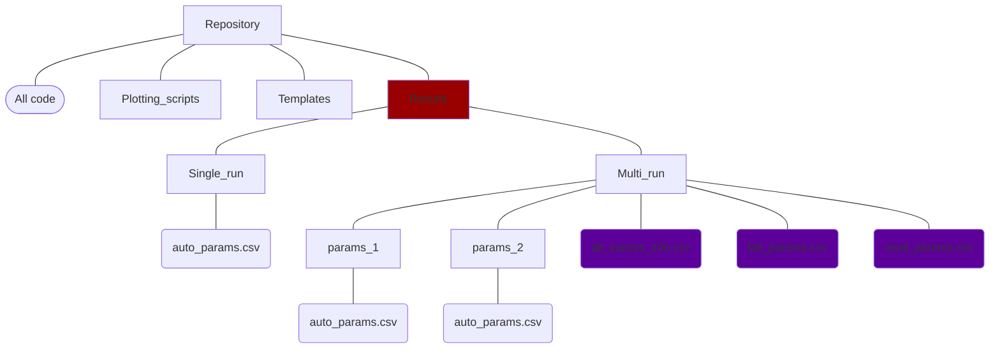

# planetesimal-magnetic-history

Thermal evolution and dynamo generation model for a planetesimal. 

[](https://zenodo.org/doi/10.5281/zenodo.11147997)

## Table of Contents

+ [Basic model description](#basic-model-description)
+ [Contents of this repository](#contents-of-this-repository)
+ [Installation](#installation)
+ [Example directory structure](#example-directory-structure)
+ [Dependencies](#dependencies)
+ [How to run the model](#how-to-run-the-model)
    + [Single run](#single-run)
    + [Automated runs](#automated-runs)
    + [Model outputs](#model-outputs)
    + [Example use](#example-use)
+ [Citing the model](#citing-the-model)
+ [Issues](#issues)
+ [References](#references)

## Basic model description
The model is described in [Sanderson et. al. 2025](https://doi.org/10.1016/j.icarus.2024.116323), "Unlocking planetesimal magnetic field histories: a refined, versatile model for thermal evolution and dynamo generation", submitted to Icarus and available as a preprint. This is a spherically symmetric 1D thermal evolution and dynamo generation model. It begins with an undifferentiated planetesimal which heats up due to decay of $^{26}Al$ and differentiates into a core and mantle. The code then tracks the thermal evolution of the core and mantle and when dynamo generation is possible.

*Schematic of the stages in planetesimal thermal evolution and dynamo generation that are modelled by this code (Figure 1, Sanderson et. al. 2025)*
## Contents of this repository
This repository contains the code required to run the model, an example run and plotting notebook and the parameter files for Sanderson et. al. 2024b. The directory contains the following subdirectories:
+ Analysis/ - scripts to analyse data or choose correct input parameters
+ Plotting_scripts - scripts to plot the output, including example output
+ Run_params_public - run parameters to accompany Sanderson et. al. 2025 and Sanderson et. al. 2024
+ Templates - csv templates required for automated running of the code and saving results
All the code in the main directory is required for running the model. To use the code but not alter its functionality you will only need to change values in `solver.py` and `parameters.py` (see below for instructions).

## Installation
1. Clone this repository
```
git clone https://github.com/Hannah-RS/learning-model.git
```
2. Create a Results subdirectory inside the repository to save your results (the code works on the structure shown in the diagram below)
3. Open `environment.yml` and choose the name for your virtual environment
4. Create a virtual environment with all required Python packages by running the following command in terminal
```
conda env create -f environment.yml
```
5. The code is now ready to be used.

### Example Directory structure

The Results directory in red must be added by the user on installation. The purple csv files must be copied across from the Templates directory after a series of runs with multiple subdirectories is complete.

### Dependencies
This code was written using Python 3.10.12 but should work for all Python 3 releases. It also requires numpy >=1.24.3 and scipy >=1.9.3 to run. It also requires matplotlib and pandas, but the specific version is not as important. A virtual environment with the required packages can be installed using the environment.yml file and the instructions above.

## How to run the model

### Single run
1. Set `automated=False` in `parameters.py` and change any desired parameters in `parameters.py`. 
2. Set the `folder` variable in `solver.py` to choose where you want to save your results.
3. Run `solver.py`. Results will appear in your chosen results directory and run parameters will be saved in `run_info.csv`.

### Automated runs
An automated series of runs is performed using `multi_run.sh` which iteratively reads in a line of parameters from `auto_params.csv` and runs the model until all parameter lines have been run. The final `status` column in `auto_params.csv` indicates whether a parameter list has been run. `status=1` indicates a completed run with no errors, `status=0` indicates an incompleted run (failed or in progress) and `status=''` indicates the run has not been started. `multi_run.sh` finishes when all rows have `status=1` or `status=0`.

Before any automated runs:
1. Set `automated = True` in `parameters.py`
2. Choose if you want to save full run output (`full_save = True`,`B_save = False`), just magnetic field output (`full_save = False`,`B_save = True`) or only summary output (`full_save = False`,`B_save = False`).
Then follow the instructions in either of the subsections below.

#### Multiple runs one folder
1. Create the directory where you wish to have the results.
2. Create auto_params.csv with run parameters in the desired folder.
3. Run `bash multi_run.sh <filepath>` in the main directory where filepath is the path from the model directory to where you want to save results

#### Multiple runs - multiple subfolders
This method is for keeping a set of parameters constant, whilst varying an individuals parameter in independent runs. It requires access to an hpc in order to create an array job. For example, the directory "Multi_run" could contain subfolders "params_1" nd "params_2" each containing an "auto_params.csv" file and could run as one directory using an array job on an hpc. "params_1/" could vary reference viscosity but keep all other variables constant and "params_2" could vary critical melt fraction and keep all other variables constant. This method was used in Sanderson et. al. 2024 to investigate the role of viscosity, core sulfur content and radiogenic $^{60}Fe$ on dynamo generation.
 
1. Create overall parameters directory e.g. "Multi_run"
2. Use `create_single_csv.py` to set your range of parameter space you are exploring.
3. Send parameters to remote machine
4. Submit an array job using an amended version of `submit_array.sh` to run `multi_run.sh`. This will run each auto_params_n.csv and create a parameter subfolder for each set of runs. 
5. Copy all results off the hpc into `<results_folder>`
6. Copy `all_sucess_info.csv`, `fail_params.csv` and `inval_params.csv` from Templates to `<results_folder>` 
7. Use `merge_results.py <results_folder> <number_of_subfolders>` to merge all results from a group of runs into a combined data file 
8. Now enjoy analysing your data!

For runs on a remote machine, it may be useful to create a subdirectory for parameter files before they are sent to the remote machine which is separate from your results subdirectory. This will enable pristine parameter files to be sent to the hpc to repeat calculations without needing to repeat steps 1 and 2. 

### Model outputs
The model outputs:
+ `run_results.csv` : summary statistics for the model run
+ `run_<n>_diff.npz` : npz file containing time series arrays for planetesimal properties prior to differentiation
+ `run_<n>.npz` : npz file containing time series arrays for planetesimal properties after differentiation 
A full description of the model output can be found in the METADATA file.

The frequency of time series output can be adjusted using `save_interval_d` and `save_interval_t` for the pre- and post-differentiation portions of the thermal evolution.

#### Magnetic field generation output
The summary file is designed to save on/off times for up to three dynamo generation periods for critical magnetic Reynolds numbers of 10, 40 and 100. `save_interval_mag` sets the minimum size for a detectable gap in dynamo generation. The minimum value is `2*save_interval_t`. Too small a minimum size will have more than 3 dynamo generation periods due to the oscillations and magnetic Reynolds number during core solidification. Too large a minumum size and you may miss gaps in dynamo generation. Larger bodies have longer gaps, so for bodies >300km radius `save_interval_mag=10*Myr` is recommended for 100km radius bodies `save_interval_mag=1*Myr`is recommended.

### Example use
The `Plotting_scripts` directory contains the results of an example run and `Example_output_plots.ipynb` contains some example plots.

## Citing the model
If you use this model please cite Sanderson et. al. 2025.

## Issues
If you have any questions about the code please email hannah.sanderson"at"earth.ox.ac.uk. 
If there are any issues or bugs in the code please raise an [issue](https://github.com/Hannah-RS/learning-model/issues)

## References
Sanderson et. al. 2025. Unlocking planetesimal magnetic field histories: A refined, versatile model for thermal evolution and dynamo generation. Icarus 425, 116323. https://doi.org/10.1016/j.icarus.2024.116323


Sanderson et. al. 2024 "Early and elongated epochs of planetesimal dynamo generation", [https://arxiv.org/abs/2405.05147](https://arxiv.org/abs/2405.05147), submitted to Earth and Planetary Science Letters


